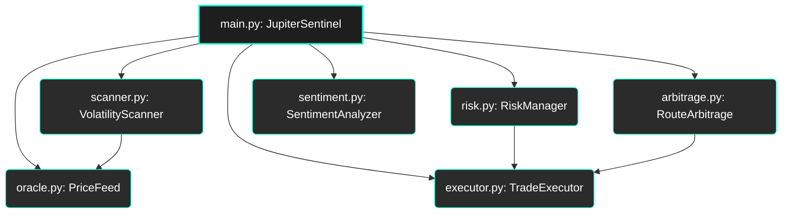
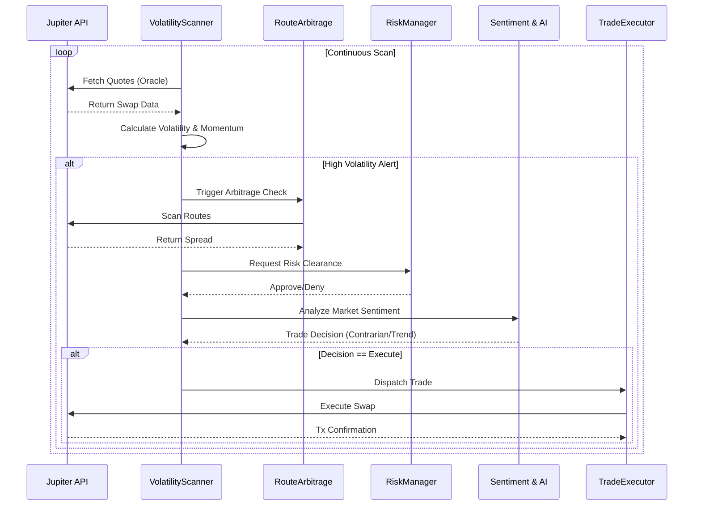
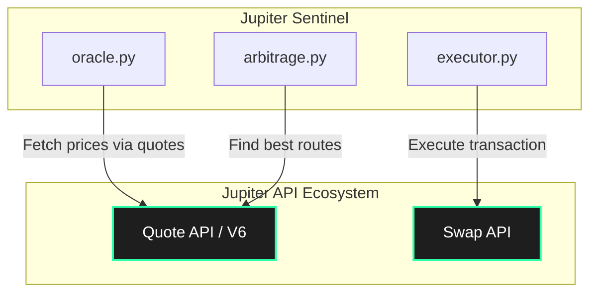

# 🏛️ Jupiter Sentinel Architecture

Jupiter Sentinel is an autonomous AI DeFi agent built for the Solana ecosystem, specifically engineered to leverage the **Jupiter Aggregator** as its primary source of truth and execution engine. 

This document outlines the core architecture, data flows, and the innovative patterns used to achieve real-time, on-chain intelligence.

---

## 🧩 1. High-Level Module Dependencies

The system is decoupled into independent modules orchestrated by the `JupiterSentinel` main class. This allows for isolated testing and robust error handling.



---

## 🔄 2. Real-Time Data Flow

The Sentinel operates on a continuous, asynchronous loop. Data is ingested from the Jupiter API, processed for volatility and arbitrage opportunities, filtered through risk management, and finally executed.



---

## 🔮 3. The "Quotes-as-Oracle" Pattern

Instead of relying on delayed or rate-limited external price oracles, Jupiter Sentinel introduces the **Quotes-as-Oracle** pattern. 

By querying the `/quote` endpoint with a standardized micro-amount, the Sentinel derives the true, deep-liquidity market price in real-time directly from the swap engine.

```mermaid
graph LR
    subgraph Traditional Architecture
        O1[External Oracle] -.-> |Delayed/Batched| SC[Smart Contract]
    end

    subgraph Sentinel Architecture (Quotes-as-Oracle)
        Q[Jupiter /quote API] --> |Real-time, Exact Route| PF[PriceFeed Module]
        PF --> |Standardized Base Amount| V[Volatility Engine]
        PF --> |Derive USD/SOL Price| V
    end

    style Q fill:#00ffcc,stroke:#000,color:#000,font-weight:bold
    style PF fill:#2b2b2b,stroke:#00ffcc,stroke-width:2px,color:#fff
    style V fill:#2b2b2b,stroke:#00ffcc,stroke-width:1px,color:#fff
```

**Benefits of this pattern:**
- **Zero Lag:** Price reflects the exact moment of execution.
- **Liquidity-Aware:** The price implicitly accounts for AMM liquidity and slippage.
- **Self-Contained:** Reduces dependency on third-party infrastructure.

---

## ⚡ 4. Jupiter API Integration Layer

The Sentinel strictly uses the Jupiter ecosystem for both data and execution, ensuring perfect synchronization between what the scanner "sees" and what the executor "does".



---

## 🛡️ Risk Management & Failsafes

1. **Dry-Run Default:** Boots in dry-run mode unless explicitly passed `--live`.
2. **Slippage Bounds:** Hardcoded limits (e.g., 50 bps) to prevent sandwich attacks.
3. **Contrarian Logic:** Avoids buying during extreme fear events unless validated by strong arbitrage metrics.
