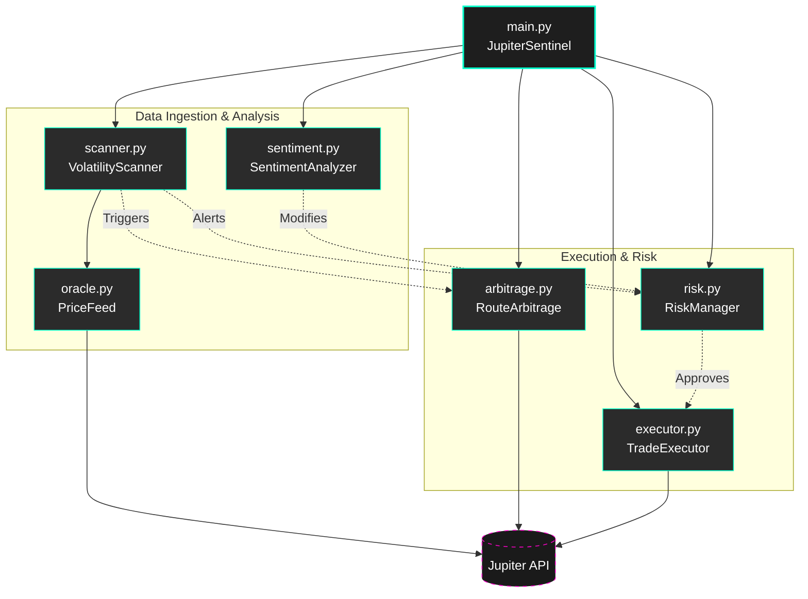
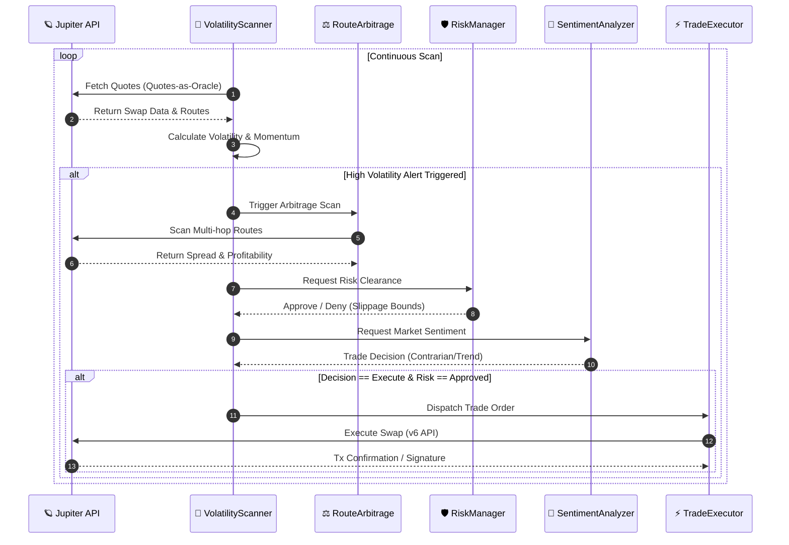

# 🏛️ Jupiter Sentinel Architecture

Jupiter Sentinel is an autonomous AI DeFi agent built for the Solana ecosystem, engineered to leverage the **Jupiter Aggregator** as its primary source of truth and execution engine. 

This document outlines the core architecture, data flows, and the innovative patterns used to achieve real-time, on-chain intelligence.

---

## 🧩 1. High-Level Module Dependencies

The system is decoupled into independent modules orchestrated by the `JupiterSentinel` main class. This allows for isolated testing, robust error handling, and separation of concerns.



---

## 🔄 2. Real-Time Data Flow

The Sentinel operates on a continuous, asynchronous loop. Data is ingested from the Jupiter API, processed for volatility and arbitrage opportunities, filtered through risk management, and finally executed.



---

## 🔮 3. The "Quotes-as-Oracle" Pattern

Instead of relying on delayed or rate-limited external price oracles (like Chainlink or Pyth for high-frequency low-cap tokens), Jupiter Sentinel introduces the **Quotes-as-Oracle** pattern. 

By querying the `/quote` endpoint with a standardized micro-amount, the Sentinel derives the true, deep-liquidity market price in real-time directly from the swap engine.

```mermaid
graph LR
    classDef jup fill:#00ffcc,stroke:#000,color:#000,font-weight:bold
    classDef mod fill:#2b2b2b,stroke:#00ffcc,stroke-width:2px,color:#fff
    classDef bad fill:#331111,stroke:#ff0000,stroke-width:1px,color:#fff,stroke-dasharray: 5 5

    subgraph Traditional Architecture
        O1[External Oracle]:::bad -.-> |Delayed/Batched| SC[Smart Contract]:::bad
    end

    subgraph Sentinel Architecture (Quotes-as-Oracle)
        Q[Jupiter /quote API]:::jup --> |Real-time Exact Route| PF[PriceFeed Module]:::mod
        PF --> |Standardized Base Amount| V[Volatility Engine]:::mod
        PF --> |Derive USD/SOL True Price| V
    end

    style Traditional Architecture fill:#111,stroke:#333
    style Sentinel Architecture (Quotes-as-Oracle) fill:#112222,stroke:#00ffcc
```

**Benefits of this pattern:**
- **Zero Lag:** Price reflects the exact moment of execution.
- **Liquidity-Aware:** The price implicitly accounts for AMM liquidity depth and slippage.
- **Self-Contained:** Reduces dependency on third-party infrastructure.

---

## ⚡ 4. Jupiter API Integration Layer

The Sentinel strictly uses the Jupiter ecosystem for both data and execution, ensuring perfect synchronization between what the scanner "sees" and what the executor "does".

```mermaid
graph TD
    classDef jup fill:#1e1e1e,stroke:#2bffaa,stroke-width:2px,color:#fff
    classDef internal fill:#2b2b2b,stroke:#00ffcc,stroke-width:1px,color:#fff

    subgraph Jupiter Sentinel Internal Modules
        Oracle[oracle.py]:::internal
        Arbitrage[arbitrage.py]:::internal
        Executor[executor.py]:::internal
    end

    subgraph 🪐 Jupiter API Ecosystem
        QuoteAPI[Quote API / V6 Endpoint]:::jup
        SwapAPI[Swap API / Transaction Engine]:::jup
    end

    Oracle -->|Fetch prices via micro-quotes| QuoteAPI
    Arbitrage -->|Find optimal & cross-dex routes| QuoteAPI
    Executor -->|Build & Sign transaction| SwapAPI
```

---

## 🛡️ Risk Management & Failsafes

1. **Dry-Run Default:** Boots in dry-run mode (`dry_run=True`) unless explicitly passed `--live`.
2. **Slippage Bounds:** Hardcoded limits (e.g., 50 bps) to prevent sandwich attacks and front-running.
3. **Contrarian Logic:** Avoids buying during extreme fear events unless validated by strong arbitrage metrics or sentiment reversals.
4. **Failsafe Shutdown:** Graceful termination handling (`SIGINT`) with comprehensive portfolio and session reporting.