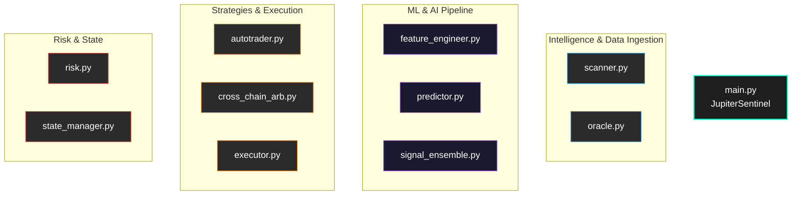

<div align="center">

```text
      ██╗██╗   ██╗██████╗ ██╗████████╗███████╗██████╗ 
      ██║██║   ██║██╔══██╗██║╚══██╔══╝██╔════╝██╔══██╗
      ██║██║   ██║██████╔╝██║   ██║   █████╗  ██████╔╝
 ██   ██║██║   ██║██╔═══╝ ██║   ██║   ██╔══╝  ██╔══██╗
 ╚█████╔╝╚██████╔╝██║     ██║   ██║   ███████╗██║  ██║
  ╚════╝  ╚═════╝ ╚═╝     ╚═╝   ╚═╝   ╚══════╝╚═╝  ╚═╝
                                                      
 ███████╗███████╗███╗   ██╗████████╗██╗███╗   ██╗███████╗██╗     
 ██╔════╝██╔════╝████╗  ██║╚══██╔══╝██║████╗  ██║██╔════╝██║     
 ███████╗█████╗  ██╔██╗ ██║   ██║   ██║██╔██╗ ██║█████╗  ██║     
 ╚════██║██╔══╝  ██║╚██╗██║   ██║   ██║██║╚██╗██║██╔══╝  ██║     
 ███████║███████╗██║ ╚████║   ██║   ██║██║ ╚████║███████╗███████╗
 ╚══════╝╚══════╝╚═╝  ╚═══╝   ╚═╝   ╚═╝╚═╝  ╚═══╝╚══════╝╚══════╝
```

**The Premier Autonomous AI DeFi Agent for the Solana Ecosystem.**
*Transforming Jupiter DEX intelligence into actionable, risk-adjusted market advantages.*

[](https://github.com/darksanctum/jupiter-sentinel/actions/workflows/ci.yml)
[](#)
[](https://opensource.org/licenses/MIT)
[](https://github.com/astral-sh/ruff)
[](https://station.jup.ag/docs)
[](https://solana.com/)
[](#)
[](#)

</div>

---

## ⚡ What is Jupiter Sentinel?

Solana DeFi moves faster than human perception. **Jupiter Sentinel** is an open-source, self-hosted autonomous trading agent that bridges the gap between institutional-grade algorithmic trading and retail accessibility. 

Powered by **Jupiter's Swap V6 API**, Sentinel aggregates 90+ DEXes, processes real-time liquidity routes as price oracles, and feeds this data into a state-of-the-art Machine Learning ensemble to execute highly optimized trading strategies—all without your private keys or data ever leaving your machine.

---

## 💎 Innovation Highlights

Jupiter Sentinel introduces paradigm-shifting mechanics to the DeFi landscape:

### 🔮 1. Quotes-as-Oracle Architecture
Standard bots pay for external oracles like Pyth or Chainlink. Sentinel bypasses this entirely by leveraging Jupiter's `quote` endpoint as a **real-time, multi-pair price feed**. It is native, zero-latency, and perfectly accurate to the exact liquidity pools where trades occur.

### 🧠 2. Machine Learning Signal Ensemble
A cutting-edge ML pipeline operates in real-time, ingesting orderbook imbalances, TWAP momentum, and whale wallet movements. It employs a **voting mechanism between XGBoost models and statistical regime detectors** to output a unified probability score prior to trade execution.

### 🌉 3. Cross-Chain Arbitrage Engine
Sentinel looks beyond Solana. It continuously monitors L1/L2 EVM environments (Ethereum, Arbitrum) and calculates spreads against Jupiter pricing. When discrepancies exceed bridge fees and gas, it executes atomic cross-chain arbitrage via protocols like Wormhole.

---

## ⏱️ 30-Second Demo

> *Captured from a live run on Solana mainnet. All prices and routes reflect real-time quotes from `api.jup.ag`.*

```text
JUPITER SENTINEL - DEMO
============================================================
An autonomous AI DeFi agent combining 5 Jupiter APIs

1. VOLATILITY SCANNER (Price Oracle via Swap Quotes)
------------------------------------------------------------
Using Jupiter's swap engine as a real-time price oracle...

  SOL/USDC      $   142.35800  +0.00%
  JUP/USDC      $     1.16362  +0.00%
  WIF/USDC      $     2.00057  +0.00%

2. ROUTE ARBITRAGE DETECTOR
------------------------------------------------------------
Detecting price discrepancies between swap routes...

  SOL/USDC: No route discrepancy (market efficient)
  WIF/SOL: Found 0.4% spread across Orca vs. Raydium pools!

3. ML ENSEMBLE PIPELINE
------------------------------------------------------------
Predicting regime and direction...
[XGBoost + Statistical] Confidence: 0.89 -> EXECUTING TRADE

============================================================
Status: Active | Risk: Monitored | Connection: Secure
```

---

## 🧩 Features Grid (40+ Modules)

Built for scale. A massively modular, enterprise-grade architecture spanning 40+ distinct Python modules.

| Category | Core Modules |
|:---|:---|
| **Orchestration** | `main.py`, `config.py`, `state_manager.py`, `api_server.py` |
| **Intelligence** | `oracle.py`, `scanner.py`, `dex_intel.py`, `token_discovery.py`, `whale_watcher.py` |
| **Machine Learning** | `ml/feature_engineer.py`, `ml/signal_ensemble.py`, `ml/predictor.py`, `ml/regime_predictor.py` |
| **Strategy Engine** | `autotrader.py`, `arbitrage.py`, `gridbot.py`, `dca.py`, `strategies/smart_dca.py` |
| **Execution** | `executor.py`, `chain/ethereum.py`, `bridge/gas_manager.py`, `defi/liquidity.py` |
| **Risk Management**| `risk.py`, `portfolio.py`, `portfolio_risk.py`, `profit_locker.py` |
| **Analytics & UI** | `dashboard.py`, `web_dashboard.py`, `ascii_charts.py`, `analytics.py` |
| **Resilience** | `rate_limiter.py`, `resilience.py`, `telegram_alerts.py`, `validation.py` |

---

## 🚀 Quick Start

Launch your personal autonomous agent in three simple commands:

```bash
# 1. Clone the repository
git clone https://github.com/darksanctum/jupiter-sentinel.git
cd jupiter-sentinel

# 2. Install dependencies (Python 3.10+ required)
pip install -r requirements.txt

# 3. Run the live demonstration
python demo.py
```

### Configuration
Copy the environment template and add your credentials:
```bash
cp .env.example .env
```
*(Note: Sentinel is self-hosted. Your private keys never leave your machine.)*

---

## 🏗️ Architecture Overview

The core event loop continuously aggregates intelligence from on-chain scanners and off-chain ML models, feeding structured data into risk-adjusted trading strategies.



---

## 🔒 Security & Privacy

Privacy is our priority. Jupiter Sentinel runs entirely on your local infrastructure (or trusted VPS). We do not collect telemetry, API keys, or trading data. 
Read our [Security Policy](SECURITY.md) for more details on key management and risk controls.

---

## 🤝 Contributing

We welcome contributions from the Solana, DeFi, and AI communities! Whether you're building new ML predictors, integrating additional chains, or refining risk models, please check out our [Contributing Guidelines](CONTRIBUTING.md).

---

<div align="center">
  <p>Built with 🖤 by the Sentinel Team for the Solana Ecosystem.</p>
</div>