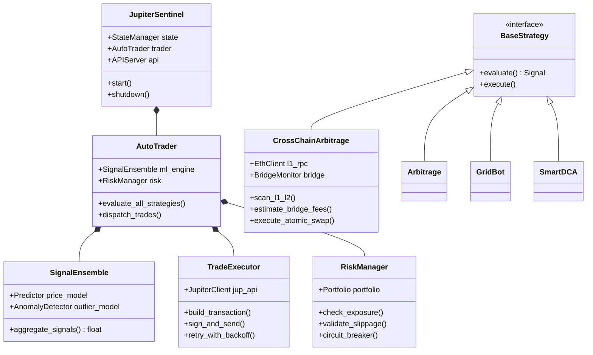
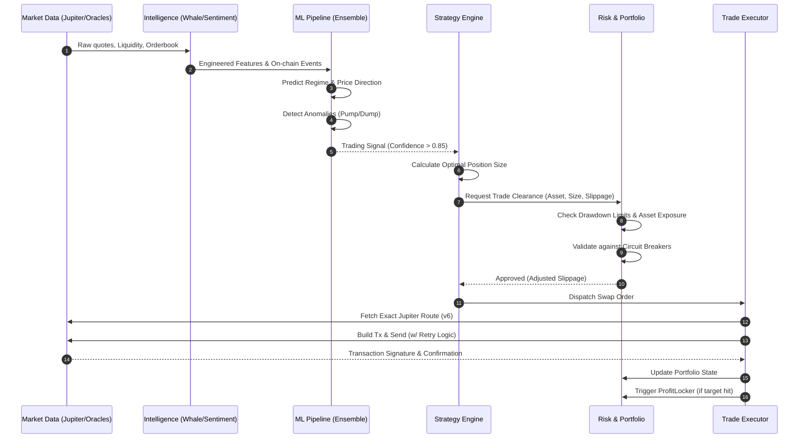
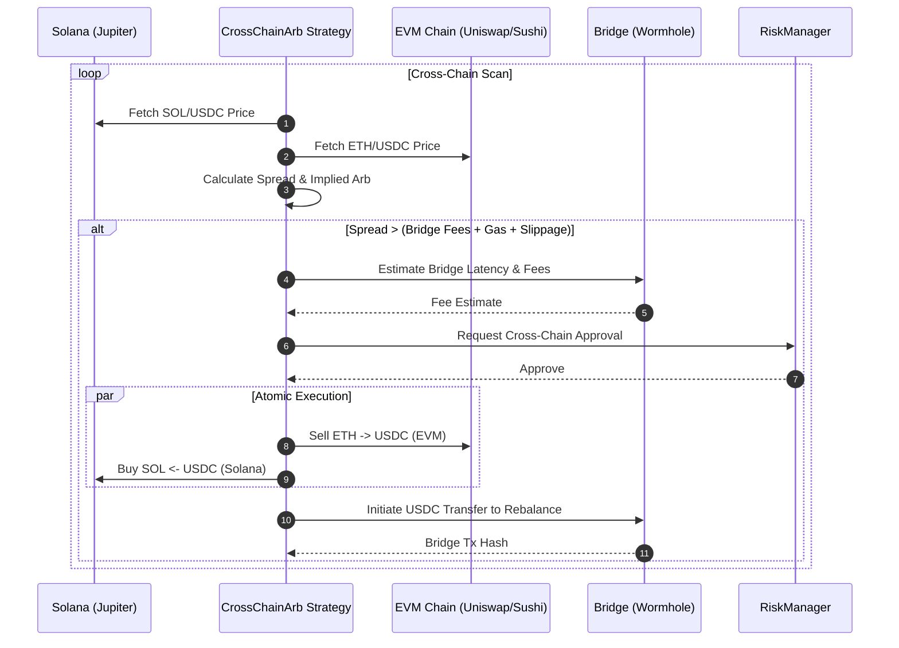

# 🏛️ Jupiter Sentinel Architecture V2 (Rounds 1-7)

Jupiter Sentinel has evolved from a simple volatility scanner into a **comprehensive, multi-chain, AI-driven autonomous trading system**. This document outlines the complete architecture, module dependencies, data flows, and external service interactions as of the V2 system.

---

## 🧩 1. System Overview & Module Dependency Graph

The Sentinel is composed of highly decoupled, specialized modules. The core event loop aggregates intelligence from on-chain scanners and off-chain ML models to execute risk-adjusted trading strategies across Solana and external chains.

```mermaid
graph TD
    classDef core fill:#1e1e1e,stroke:#00ffcc,stroke-width:2px,color:#fff
    classDef intel fill:#2b2b2b,stroke:#3498db,stroke-width:1px,color:#fff
    classDef ml fill:#1a1a2e,stroke:#9d4edd,stroke-width:1px,color:#fff
    classDef strat fill:#2b2b2b,stroke:#e67e22,stroke-width:1px,color:#fff
    classDef risk fill:#2b2b2b,stroke:#e74c3c,stroke-width:1px,color:#fff
    classDef external fill:#1a1a1a,stroke:#ff00cc,stroke-width:1px,color:#fff,stroke-dasharray: 5 5

    Main[main.py<br/>JupiterSentinel]:::core
    API[api_server.py<br/>FastAPI]:::core
    UI[web_dashboard.py<br/>React/Dash]:::core

    subgraph Intelligence & Data Ingestion
        Scanner[scanner.py]:::intel
        Oracle[oracle.py]:::intel
        Sentiment[sentiment.py]:::intel
        Whale[whale_watcher.py]:::intel
        Regime[regime_detector.py]:::intel
        Intel[dex_intel.py]:::intel
        Micro[microstructure.py]:::intel
    end

    subgraph ML & AI Pipeline
        Feature[feature_engineer.py]:::ml
        Predictor[predictor.py]:::ml
        Anomaly[anomaly_detector.py]:::ml
        Ensemble[signal_ensemble.py]:::ml
        Optimizer[self_optimizer.py]:::ml
    end

    subgraph Strategies & Execution
        Auto[autotrader.py]:::strat
        Arb[arbitrage.py]:::strat
        CrossChain[cross_chain_arb.py]:::strat
        Grid[gridbot.py]:::strat
        DCA[smart_dca.py]:::strat
        Executor[executor.py]:::strat
    end
    
    subgraph Risk, State & Resilience
        Risk[risk.py]:::risk
        Portfolio[portfolio.py]:::risk
        Profit[profit_locker.py]:::risk
        State[state_manager.py]:::risk
        Resilience[resilience.py]:::risk
    end

    JupiterAPI[(Jupiter v6 API)]:::external
    Ethereum[(Ethereum L1/L2)]:::external
    Wormhole[(Wormhole/LayerZero)]:::external
    Telegram[(Telegram/Discord)]:::external

    Main --> Scanner
    Main --> Auto
    Main --> Risk
    Main --> API
    
    API --> UI
    
    Scanner --> Oracle
    Scanner --> Sentiment
    Scanner --> Whale
    Scanner --> Regime
    Scanner --> Micro
    
    Scanner --> Feature
    Feature --> Predictor
    Feature --> Anomaly
    Predictor --> Ensemble
    Ensemble --> Auto
    Optimizer -.->|Updates Params| Auto
    
    Auto --> Arb
    Auto --> CrossChain
    Auto --> Grid
    Auto --> DCA
    
    Arb --> Executor
    CrossChain --> Executor
    Grid --> Executor
    DCA --> Executor
    
    Executor --> Resilience
    Resilience --> Risk
    Risk --> Executor
    
    Executor --> JupiterAPI
    CrossChain --> Ethereum
    CrossChain --> Wormhole
    
    Executor --> Portfolio
    Portfolio --> Profit
    State --> Main
    Main --> Telegram
```

---

## 🧬 2. Core Class Hierarchy

The object-oriented design leverages base classes and strategy interfaces to allow rapid deployment of new trading algorithms without modifying the core execution engine.



---

## ⚡ 3. End-to-End Trading Data Flow

The following sequence details how market data is ingested, processed through the ML pipeline, validated by the Risk Manager, and ultimately executed on-chain.



---

## 🌉 4. Cross-Chain & Bridge Execution Flow

A major addition in later rounds is the **Cross-Chain Arbitrage** capability, allowing Sentinel to monitor L1/L2 environments (e.g., Ethereum, Arbitrum) and execute trades back to Solana via bridging protocols.



---

## 🛡️ 5. Subsystem Details

### ML & AI Pipeline (`src/ml/`)
- **`feature_engineer.py`**: Normalizes real-time orderbook imbalances, TWAP, and momentum.
- **`signal_ensemble.py`**: Uses a voting mechanism between XGBoost models and statistical regime detectors to output a unified probability score.
- **`self_optimizer.py`**: Periodically backtests recent trades against historical data to auto-tune hyper-parameters (e.g., stop-loss percentages, grid spacing).

### Risk & Resilience (`src/`)
- **`resilience.py`**: Implements exponential backoffs, RPC node rotation, and automatic transaction retries for failed Solana transactions.
- **`profit_locker.py`**: Automatically takes partial profits at defined dynamic tiers (e.g., 20% at 2x, 50% at 5x) ensuring realized gains.
- **`jupiter_limits.py`**: Hardcoded rate limiting and queueing to avoid being banned by the Jupiter API.

### External Service Interactions
- **Jupiter API (v6)**: Primary source for Quotes, Routes, and Swap instructions.
- **RPC Providers (Helius, QuickNode)**: Transaction broadcasting and on-chain state monitoring.
- **EVM RPCs (Infura, Alchemy)**: Monitored via `chain/ethereum.py` for cross-chain arbitrage.
- **Telegram/Discord**: Real-time push notifications for executed trades, errors, and daily PnL reports via `notifications.py` and `telegram_alerts.py`.