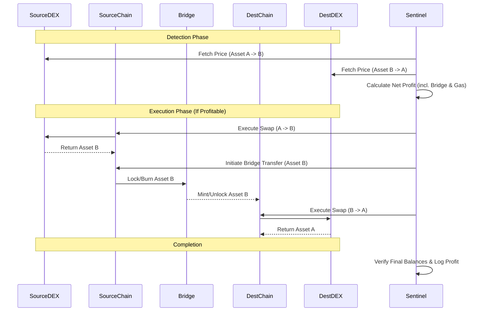

# Cross-Chain Architecture

Jupiter Sentinel's cross-chain architecture is designed to identify and execute arbitrage opportunities across multiple blockchain networks while managing the complexities of bridging, gas fees, and varying block times.

## Supported Chains

The system is currently built to support or easily extend to the following networks:

*   **Ethereum (L1):** The primary liquidity hub, used for settlement and large-volume arbitrage.
*   **Solana:** High-speed, low-cost network (native to Jupiter), acting as the core execution layer.
*   **Layer 2s (Arbitrum, Optimism, Base):** Used for lower-cost EVM-compatible execution.
*   **Other Alt-L1s (BSC, Polygon, Avalanche):** Supported based on liquidity and bridging availability.

## Bridge Integrations

To move capital efficiently, the system relies on a combination of messaging protocols and liquidity networks:

1.  **Wormhole:** Primary messaging and token bridge for generic cross-chain transfers, especially Solana ↔ EVM.
2.  **LayerZero:** Secondary messaging protocol for broad alt-L1 coverage and fallback routing.
3.  **Stargate / Circle CCTP:** Used for native USDC transfers with zero slippage, minimizing bridging risk.
4.  **Fast Bridges (Across, Hop):** Utilized for immediate EVM-to-EVM liquidity when speed is critical for an arbitrage opportunity.

## Arbitrage Detection

The `cross_chain_arb.py` and `cross_chain_arbitrage.py` modules handle the detection logic:

1.  **Price Polling:** Continuous polling of DEXs across supported chains for target asset pairs.
2.  **Spread Calculation:** Calculates the real spread by accounting for bridging fees, destination gas costs, and estimated slippage on both the source and destination DEXs.
3.  **Execution Threshold:** An opportunity is only signaled if the net projected profit exceeds the minimum threshold defined in the risk parameters.

## Gas Management

Managing gas across multiple chains is critical to profitability:

*   **Gas Estimation (`bridge/gas_manager.py`):** Dynamically estimates gas costs on the destination chain before initiating a bridge transfer.
*   **Native Token Reserves:** The system maintains a minimum balance of native gas tokens (ETH, SOL, MATIC, etc.) on all active chains to ensure transactions do not fail due to out-of-gas errors.
*   **Gas Hedging:** When gas prices are highly volatile (e.g., Ethereum), the system may temporarily disable cross-chain arbitrage involving that chain to prevent unexpected execution costs from eating profits.

## Security Considerations

Cross-chain operations introduce significant risk vectors. Jupiter Sentinel mitigates these through:

1.  **Bridge Risk Limits:** Cap on the total capital allowed in transit via any single bridge at one time.
2.  **Slippage Tolerance:** Strict slippage limits on both the initial swap and the destination swap.
3.  **Timeout Monitoring (`bridge/monitor.py`):** Tracks pending bridge transactions. If a transaction takes longer than the expected finality time, alerts are triggered, and subsequent trades dependent on those funds are halted.
4.  **Reorg Protection:** Waits for sufficient block confirmations on the source chain before assuming funds are safely bridged, adapting the required confirmations based on the specific chain's consensus mechanism.

## Architecture Diagram: Cross-Chain Fund Flow

